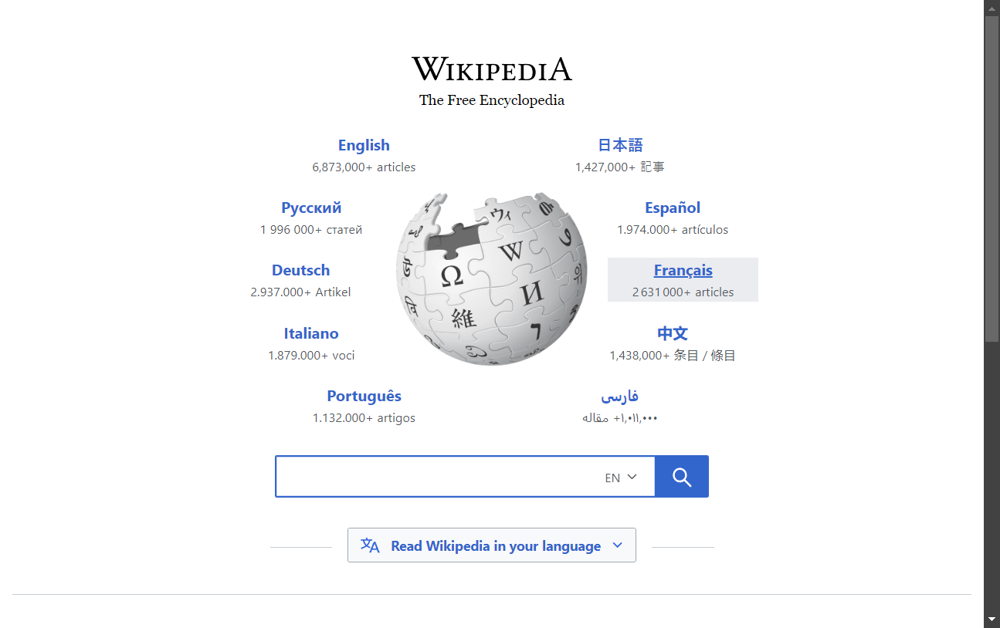
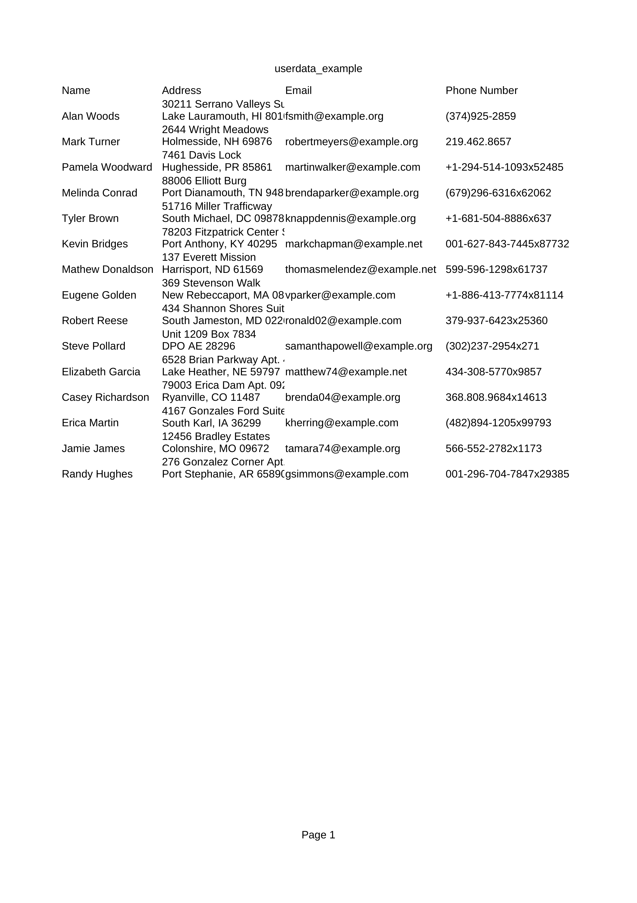

# 🌟 **Dark Serve** 🌟

 <!-- Replace with your logo path -->

🚀 **Dark Serve** is a versatile web application designed to provide essential services such as a **PDF with QR Code Generator**, **Random User Data Generator**, and **Website Screenshot Service**. Developed by Team **Dark Duo**, our goal is to streamline online tasks and enhance user experience across various platforms. 💻✨

---

## 🔥 **Why Choose Dark Serve?** 🔥

In today’s fast-paced digital age, efficiency and accessibility are key. Here’s why **Dark Serve** is the perfect solution for your needs:

- **📄 PDF & QR Code Generation**: Easily create PDFs and scannable QR codes for quick sharing and access.
- **🆔 Random User Data Generation**: Generate realistic user data for testing and development.
- **🌐 Website Screenshot Service**: Effortlessly capture and save website screenshots — a lifesaver for developers and marketers alike!
- **⚡ User-Friendly Interface**: Enjoy a clean, intuitive UI that simplifies your tasks and boosts productivity. 🎨

---

## 🚀 **Use Cases & Practical Applications** 💡

### 1. 👨‍💻 **For Developers**
   - **Testing Applications**: Use the random user data generator to simulate user interactions during development. 🧪
   - **Documentation**: Quickly create PDFs for project reports, documentation, and more. 📑

### 2. 📈 **For Marketers**
   - **Campaigns**: Generate QR codes to drive traffic to landing pages or promotions. 📢
   - **Content Sharing**: Capture website screenshots to use in presentations or social media campaigns. 💼

### 3. 👩‍🏫 **For Educators**
   - **Resource Creation**: Easily generate educational materials in PDF format for students. 📚
   - **Interactive Learning**: Use QR codes to link students to additional reading materials or resources. 🧠🔗

---

## 🗂 **Project Structure** 🏗

Here’s a quick overview of the project structure to help you navigate:

```
DARK SERVE/
│
├── static/
│   ├── css/
│   │   ├── qr_code.css
│   │   ├── random_user.css
│   │   ├── screenshot.css
│   │   └── style.css
│   └── images/
│       ├── assets/
│       ├── examples/
│       ├── favicon/
│       └── team member/
│
├── templates/
│   ├── index.html
│   ├── qr_code.html
│   ├── random_user.html
│   └── screenshot.html
│
├── app.py
├── generated.csv
├── generated.pdf
├── README.md
└── requirements.txt
```
---

## 🚀 **Features** 🌟

- **PDF Generation** 📄: Turn your input data into beautifully formatted PDFs.
- **QR Code Creation** 📱: Generate QR codes instantly for any input data.
- **Random User Data Generator** 🆔: Get random user profiles for testing, including names, addresses, and contact details.
- **Website Screenshot Service** 📸: Capture snapshots of any website with just a URL.

---

## 🎯 **How It Works** 🔧

1. **📝 PDF Generation**: Users can input data to generate custom PDFs and QR codes, allowing for easy sharing of information. 📄
2. **🆔 Random User Data**: The app generates random user profiles, including names, addresses, and contact details, making it great for testing apps or websites. 👤💻
3. **🌐 Screenshot Service**: Enter a website URL, and capture a screenshot of the site for quick reference, analysis, or sharing. 📸🌍

---

## 📸 **Screenshots**

| PDF Generation  | QR Code Example  | Random User Data  |
|-----------------|------------------|-------------------|
|  |  |  |

---

## 🌟 **Contribution** 💻

Contributions are welcome! Whether it's improving the code, fixing bugs, or adding new features, feel free to open an issue or submit a pull request. 😊

---

## 💬 **Contact**

For any inquiries or suggestions, feel free to reach out! 💌

- **Email**: koushiksarkar741777@gmail.com
- **GitHub**: [koushik777-lab](https://github.com/koushik777-lab)

*Happy Coding!* 😄🚀
